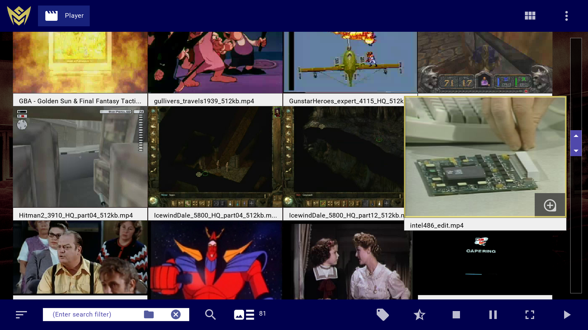

## Membrane Media Player

This GUI application was created to run on Microsoft Windows, macOS, and Linux computers. Its primary purpose is to browse video and audio files, provide a detailed view of video timelines, and execute playback of a single media file or many media files at once.

 

Builds: https://membranesoftware.com/membrane-media-player/

About Membrane Media Player: https://membranesoftware.com/i/about-membrane-media-player

### Third-Party Dependencies

Membrane Media Player makes use of other software components.

- [curl](https://curl.se/): the multiprotocol file transfer library
- [ffmpeg](https://www.ffmpeg.org/): a complete, cross-platform solution to record, convert, and stream audio and video
- [freetype](https://www.freetype.org/): a freely available software library to render fonts
- [jpeg](http://jpegclub.org/reference/reference-sources/): the Independent JPEG Group reference implementation of the JPEG standard
- [libpng](http://www.libpng.org/pub/png/libpng.html): the official reference library for PNG images
- [lua](https://www.lua.org/): a lightweight embeddable scripting language
- [openssl](https://www.openssl.org/): a robust, commercial-grade, and full-featured toolkit for the Transport Layer Security (TLS) and Secure Sockets Layer (SSL) protocols
- [sdl2](https://www.libsdl.org/): a cross-platform development library designed to provide low level access to audio, keyboard, mouse, joystick, and graphics hardware
- [sdl2image](https://www.libsdl.org/projects/SDL_image/): an image file loading library
- [sqlite](https://sqlite.org/): an in-process library that implements a self-contained, serverless, zero-configuration, transactional SQL database engine
- [x264](https://www.videolan.org/developers/x264.html): a free software library and application for encoding video streams into the H.264/MPEG-4 AVC compression format
- [zlib](https://zlib.net/): A Massively Spiffy Yet Delicately Unobtrusive Compression Library

## Reference Source

The Membrane Media Player source files provide examples for possible ways to solve certain problems.

- Playing sound by use of the SDL audio device interface: [SoundMixer.cpp](src/SoundMixer.cpp) start method and audioCallback function
- Generating an SDL render texture from downloaded image data: [ImageWindow.cpp](src/ImageWindow.cpp) executeCreateImageFromUrlResponseData method
- Processing SDL keyboard and mouse input events: [Input.cpp](src/Input.cpp) pollEvents method
- Processing ffmpeg audio and video streams decoded from a media file: [Video.cpp](src/Video.cpp) executeReadPackets method
- Writing an ffmpeg video stream composed from captured frame images: [MediaWriter.cpp](src/MediaWriter.cpp) executeWritePackets method
- Parsing subtitle entries from srt (SubRip) files: [SubtitleReader.cpp](src/SubtitleReader.cpp) readSubtitles method
- Rendering audio visualization as a waveform line: [WaveformShader.cpp](src/WaveformShader.cpp) updateRenderState and assignParticlePositions methods
- Drawing a line of pixels by use of Bresenham's line algorithm: [Shader.cpp](src/Shader.cpp) drawLine method
- Storing and retrieving records in sqlite3 files: [Database.cpp](src/Database.cpp) open and exec methods
- Running a text string as Lua script: [LuaScript.cpp](src/LuaScript.cpp) run method
- Making C++ functions available for call by Lua scripts: [LuaScript.cpp](src/LuaScript.cpp) constructor
- Sending an http or https request with libcurl: [Network.cpp](src/Network.cpp) sendHttpRequest method
- Reading freetype character and glyph data from a ttf file: [Font.cpp](src/Font.cpp) load method
- Generating pseudo-random numbers by use of the Mersenne Twister algorithm: [Prng.cpp](src/Prng.cpp) seed and extract methods
- Executing filesystem operations in Windows, Mac, or Linux environments: [OsUtil.cpp](src/OsUtil.cpp) fileExists, getFileSize, getFileMtime, getFileType methods, plus others
- Detecting available network interfaces in Windows, Mac, or Linux environments: [Network.cpp](src/Network.cpp) resetInterfaces method
